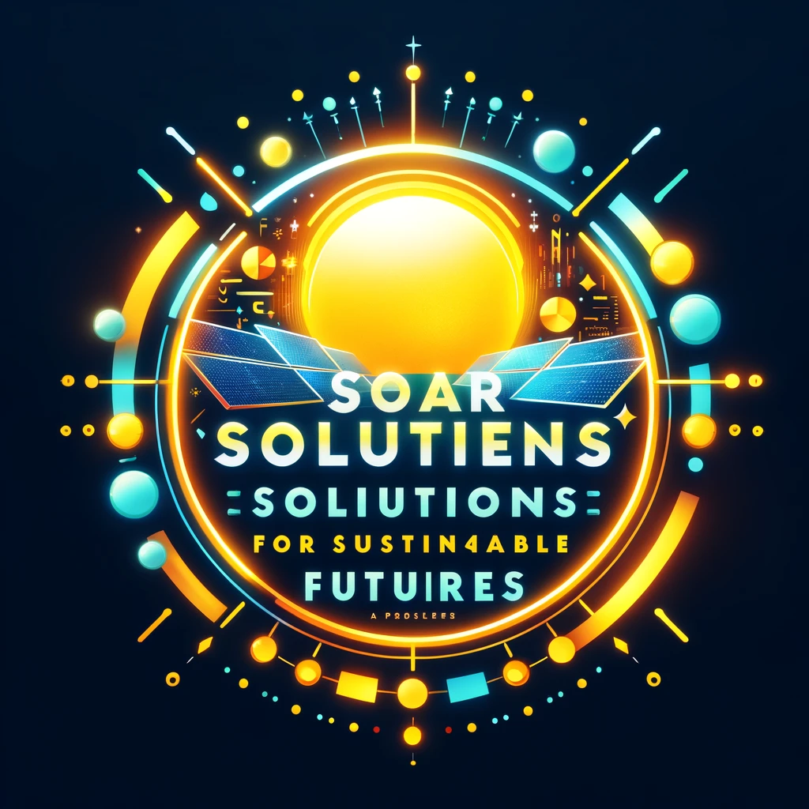

# Solar Solutions for Sustainable Futures

## Advancing Solar Energy for Everyday Use

### Harnessing the Sun: A Key to Renewable Futures

Solar energy plays a vital role in the global shift towards renewable energy, with **innovative panels**, *solar farms*, and ~~conventional power grids~~.

#### Types of Solar Panels

- **Monocrystalline Solar Panels** - High efficiency
- **Polycrystalline Solar Panels**
  - Cost-effective
  - Widely used in residential areas

##### Explore More

[Learn More About Solar Energy](https://www.example.com)

###### Visualizations



[PDF Example](files/posts_2160c69a-411e-4098-9e1e-16fd99b1f119.pdf)

###### Code Insights

```python
def solar_panel_output(sunlight_intensity, panel_efficiency):
  return sunlight_intensity * panel_efficiency
```

###### Data Tables

| Panel Type        | Efficiency | Cost        |
|-------------------|------------|-------------|
| Monocrystalline   | High       | Expensive   |
| Polycrystalline   | Medium     | Affordable  |

###### Inspirational Quotes

> "Solar energy - Lighting up the world sustainably."
>
> "Embrace the sun, for it powers our future."

###### Styling Text

Bold and italic are used to highlight **important aspects** and add _emphasis_.

---

###### Separator Lines

---

This post demonstrates the formatting capabilities in Markdown for a blog focused on solar energy.
