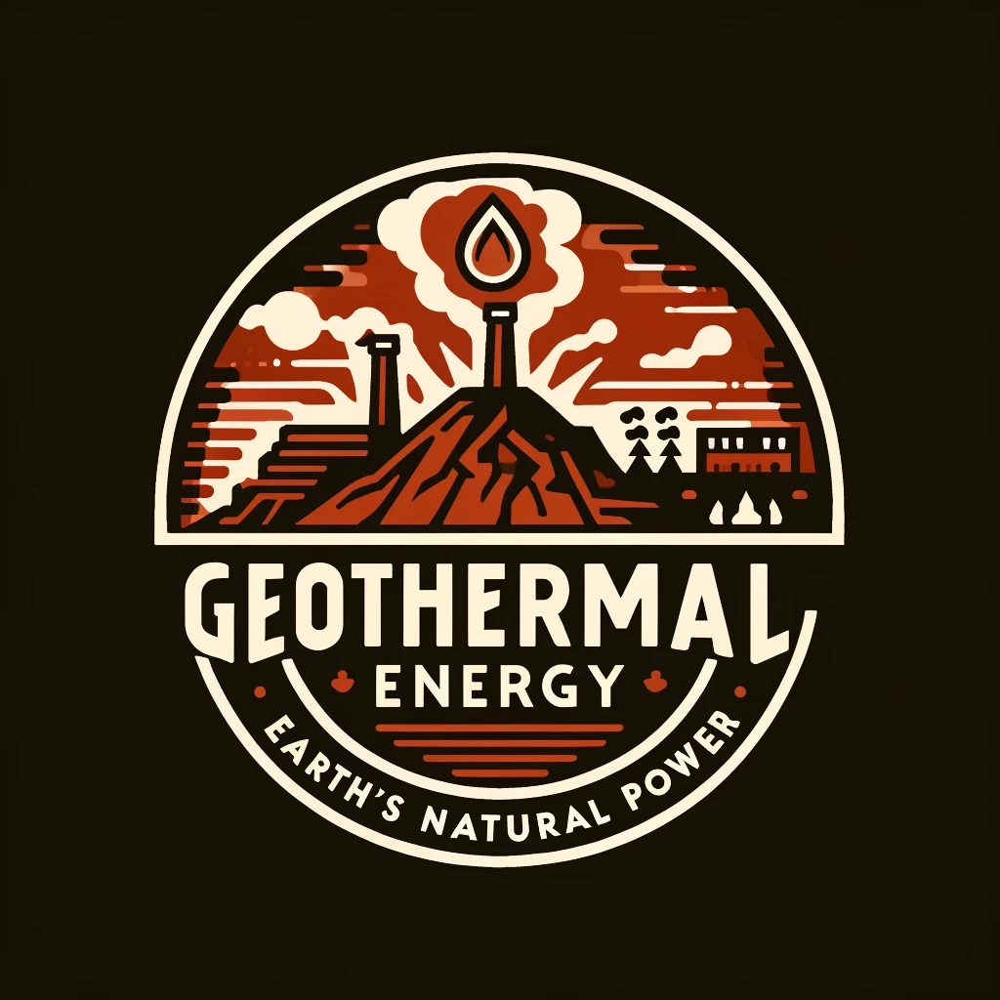

# Geothermal Energy: Earth's Natural Power

## Tapping into the Earth for Sustainable Energy

### The Power Beneath: Exploring Geothermal Energy

Geothermal energy is an essential part of our renewable energy toolkit, featuring **natural hot springs**, *geothermal power plants*, and ~~traditional energy sources~~.

#### Types of Geothermal Power Systems

- **Dry Steam Power Stations** - Directly harness steam
- **Binary Cycle Power Stations**
  - Utilize lower temperature water
  - Most common in residential heating systems

##### Explore More

[Learn About Geothermal Energy](https://www.example.com)

###### Visualizations



###### Code Insights

```python
def geothermal_power_output(heat_flow, conversion_efficiency):
  return heat_flow * conversion_efficiency
```

###### Data Tables

| System Type         | Efficiency | Environmental Impact |
|---------------------|------------|----------------------|
| Dry Steam           | High       | Low                  |
| Binary Cycle        | Moderate   | Very Low             |

###### Inspirational Quotes

> "Geothermal energy - Tapping into the earth to power our future."
>
> "The earth has endless power; just dig deeper."

###### Styling Text

Bold and italic are used to emphasize **key features** and add _subtle highlights_.

---

###### Separator Lines

---

This is a post designed to showcase Markdown capabilities for a blog focused on geothermal energy.
