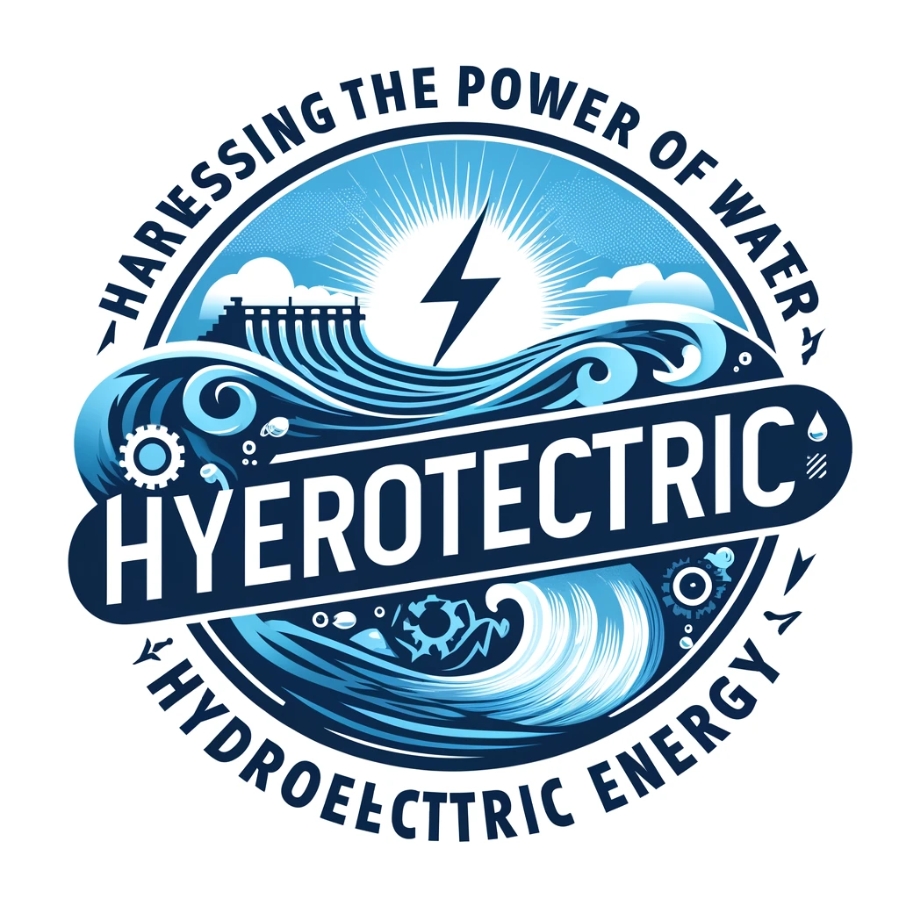

# Harnessing the Power of Water: Hydroelectric Energy

## Hydroelectric Power: Clean and Renewable

### Sustainable Energy from Water

Hydroelectric power is a cornerstone of renewable energy, utilizing **massive dams**, *river turbines*, and ~~fossil fuels~~.

#### Types of Hydroelectric Facilities

- **Impoundment Facilities** - Utilize a dam to store river water in a reservoir.
- **Run-of-River Facilities**
  - Do not store water
  - Generate power from the flow of the river

##### Explore More

[Learn More About Hydro Power](https://www.example.com)

###### Visualizations



###### Code Insights

```python
def hydro_power_calculation(flow_rate, height):
  return flow_rate * height * 9.81 * 0.9  # Example formula for potential power output
```

###### Data Tables

| Facility Type       | Power Output | Environmental Impact |
|---------------------|--------------|----------------------|
| Impoundment         | High         | Moderate             |
| Run-of-River        | Variable     | Low                  |

###### Inspirational Quotes

> "Water is the driving force of all nature."
>
> "Channeling water today for a sustainable tomorrow."

###### Styling Text

Use of bold and italic to stress **important concepts** and provide _additional context_.

---

###### Separator Lines

---

This post demonstrates the capabilities of Markdown for a blog focusing on hydroelectric energy.
