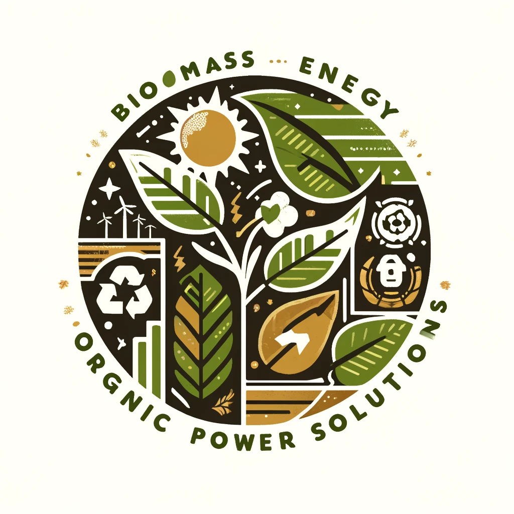

# Biomass Energy: Organic Power Solutions

## Sustainable Biomass for Renewable Futures

### Biomass Energy: A Comprehensive Overview

Biomass energy, utilizing **organic materials**, *biodegradable wastes*, and ~~non-renewable resources~~, is a vital component of the renewable energy landscape.

#### Types of Biomass Energy Systems

- **Solid Biomass** - Uses wood, crops, and other organic materials
- **Biogas Systems**
  - Generate energy from decomposing organic matter
  - Suitable for residential and industrial uses

##### Explore More

[Discover More About Biomass Energy](https://www.example.com)

###### Visualizations



###### Code Insights

```python
def biomass_energy_output(organic_mass, conversion_efficiency):
  return organic_mass * conversion_efficiency
```

###### Data Tables

| Energy Type      | Efficiency | Environmental Impact |
|------------------|------------|----------------------|
| Solid Biomass    | Moderate   | Variable             |
| Biogas           | High       | Low                  |

###### Inspirational Quotes

> "Biomass energy - Converting waste into power."
>
> "Sustainability starts with turning what we discard into what we need."

###### Styling Text

Use bold and italic to emphasize **important aspects** and provide _additional insights_.

---

###### Separator Lines

---

This post demonstrates Markdown capabilities for a blog focused on biomass energy.
