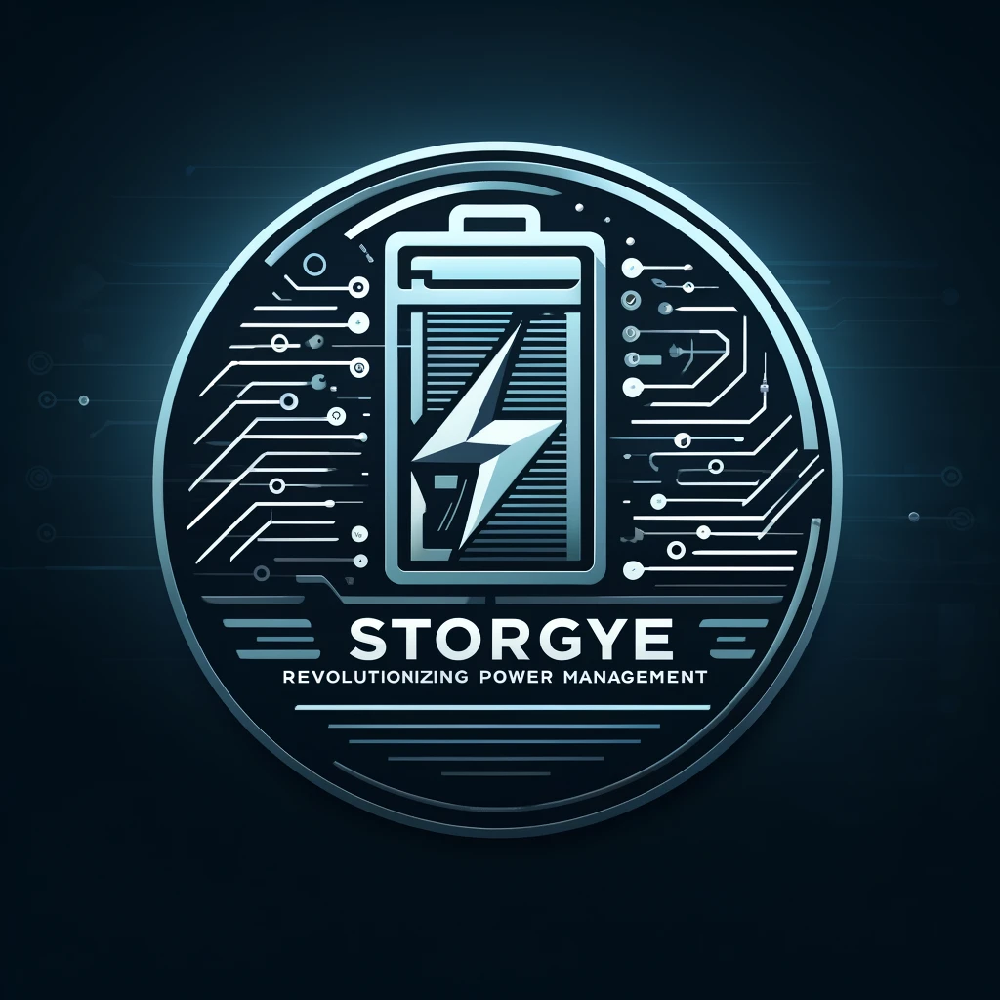

# Energy Storage: Revolutionizing Power Management

## The Future of Energy Storage

### The Critical Role of Energy Storage in Renewable Integration

Energy storage systems are pivotal in managing renewable energy, allowing for **storing excess power**, *balancing grid demands*, and ~~inefficient energy use~~.

#### Types of Energy Storage Systems

- **Lithium-Ion Batteries** - Widely used in both residential and commercial applications
- **Flow Batteries**
  - Ideal for large-scale energy storage
  - Provide high reliability for renewable energy grids

##### Explore More

[Discover Energy Storage Technologies](https://www.example.com)

###### Visualizations



###### Code Insights

```python
def energy_storage_capacity(battery_type, capacity):
  return battery_type * capacity
```

###### Data Tables

| Storage Type     | Efficiency | Scalability |
|------------------|------------|-------------|
| Lithium-Ion      | High       | Moderate    |
| Flow Batteries   | Medium     | High        |

###### Inspirational Quotes

> "Store today's energy to power tomorrow's world."
>
> "Energy storage is not just a solution, it’s a revolution."

###### Styling Text

Emphasis on **key points** and _detailed insights_ through the use of bold and italic text.

---

###### Separator Lines

---

This post demonstrates the Markdown capabilities for a blog focused on energy storage.
