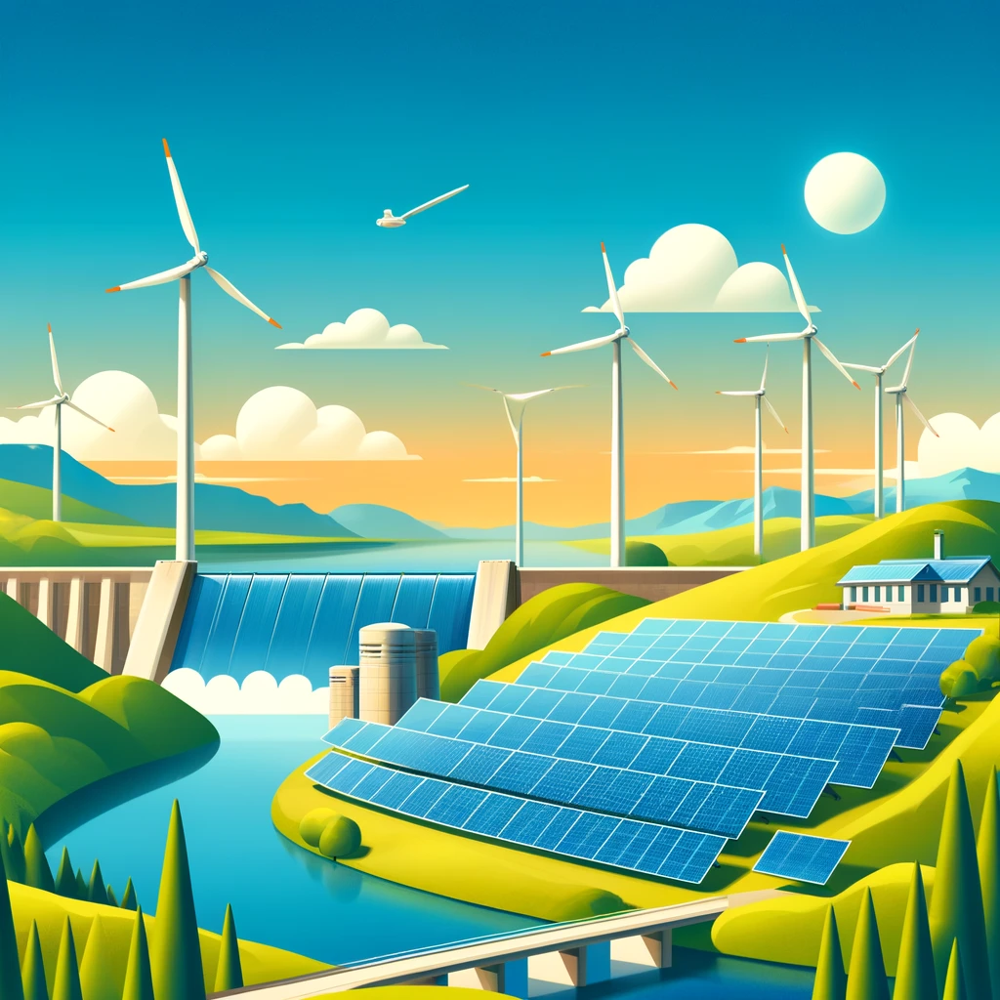

# The Future of Renewable Energy

## The Impact of Solar Power

### Advancing Solar Technology

Solar energy is becoming more accessible and efficient with advancements in **photovoltaic cells**, *energy storage solutions*, and ~~traditional power methods~~.

#### Renewable Sources

- **Solar Panels** - Harness sunlight
- **Wind Turbines**
  - Onshore projects
  - Offshore innovations

1. **Hydroelectric Power** - Water-driven energy
2. **Geothermal Energy**
   1. Surface applications
   2. Deep-earth solutions

##### Useful Resources

[Learn More About Renewable Energy](https://www.example.com)

###### Visuals



###### Code Snippets

```python
def calculate_efficiency(solar_output, solar_input):
  return (solar_output / solar_input) * 100
```

```
This is a generic block of code
```

###### Tables

| Energy Type  | Cost Efficiency | Sustainability |
|--------------|-----------------|----------------|
| Solar Energy | High            | Very High      |
| Wind Energy  | Medium          | High           |

###### Quotes

> "Renewable energy is not just a necessity now, it's an imperative for a sustainable future."
>
> "Every megawatt of solar power installed prevents tons of CO2 emissions."

###### Emphasis

You can also use **bold** and _italic_ to make important points stand out.

---

###### Horizontal Lines

---

This post showcases various formatting options in Markdown, helping organize content effectively and making it appealing for readers interested in renewable energy.
