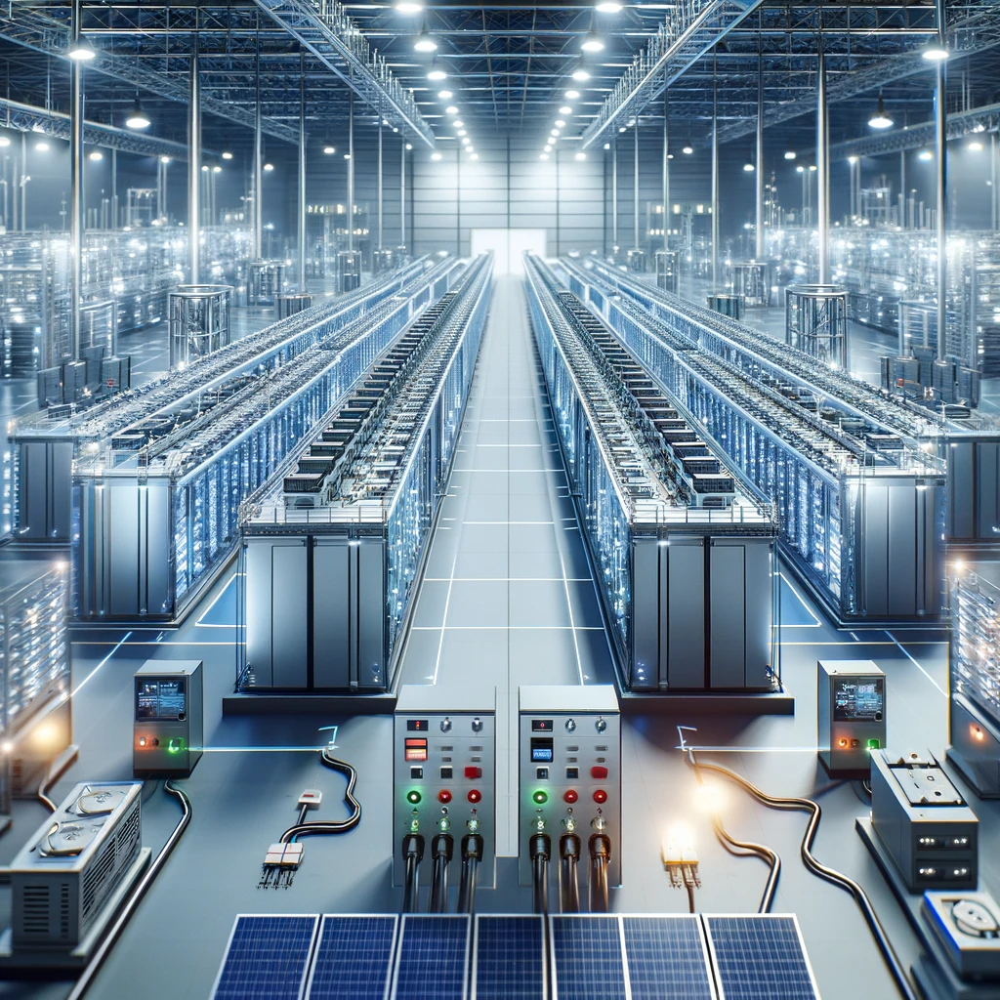

# Revolutionizing Energy Storage

## Battery Technologies Leading Change

### Next-Generation Energy Storage Solutions

Energy storage is pivotal for balancing supply and demand in renewable energy systems, featuring **advanced batteries**, *grid solutions*, and ~~conventional methods~~.

#### Key Storage Technologies

- **Lithium-Ion Batteries** - Dominates market
- **Flow Batteries**
  - Suitable for large scale storage
  - Long lifespan

##### Further Information

[Learn About Energy Storage Technologies](https://www.example.com)

###### Visual Elements



###### Coding Examples

```python
def storage_capacity(battery_capacity, efficiency):
  return battery_capacity * efficiency
```

###### Comparative Tables

| Battery Type     | Capacity | Durability |
|------------------|----------|------------|
| Lithium-Ion      | High     | High       |
| Flow             | Medium   | Very High  |

###### Motivational Quotes

> "Energy storage transforms renewable power into a 24/7 resource."
>
> "The future of energy is not just generation, but also smart storage."

###### Emphasis Techniques

Use **bold** and _italic_ for emphasis and to make key data stand out.

---

###### Dividers

---

This third post explores energy storage, further illustrating how Markdown can be used to present complex topics in a structured and engaging way.
